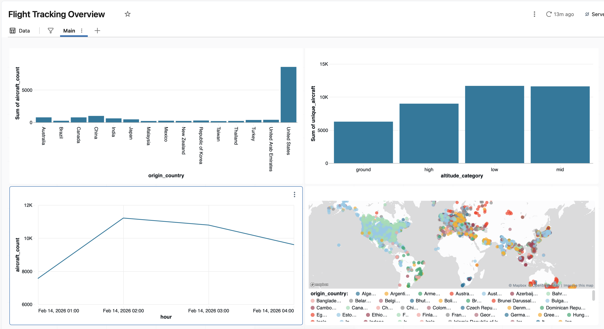

# OpenSky Flight Tracking Pipeline

Real-time flight tracking data pipeline built on Azure Databricks.



## Architecture
```
OpenSky API → Landing Zone → Auto Loader → Bronze → Silver → Gold → Dashboard
```

**Stack:** Azure Databricks, Delta Lake, Unity Catalog, Structured Streaming

## Pipeline

| Layer | Table | Description |
|-------|-------|-------------|
| Bronze | `opensky_states` | Raw API snapshots |
| Bronze | `opensky_states_streaming` | Streaming ingestion via Auto Loader |
| Silver | `flight_states` | Deduplicated, validated, enriched |
| Gold | `flights_by_country` | Country aggregates |
| Gold | `altitude_distribution` | Altitude band aggregates |
| Gold | `hourly_traffic` | Hourly summaries |

## Features

- **Batch + Streaming** ingestion patterns
- **Medallion architecture**: Bronze → Silver → Gold
- **Data quality**: Null checks, deduplication, derived fields
- **Geospatial**: Live aircraft position mapping
- **Infrastructure as code**: Databricks Asset Bundles

## Quick Start
```bash
# Clone into Databricks Repos, then run:
CREATE CATALOG IF NOT EXISTS flight_tracking;
CREATE SCHEMA IF NOT EXISTS flight_tracking.bronze;
CREATE SCHEMA IF NOT EXISTS flight_tracking.silver;
CREATE SCHEMA IF NOT EXISTS flight_tracking.gold;
CREATE VOLUME IF NOT EXISTS flight_tracking.bronze.landing_zone;
```

Run notebooks in order: `01` → `02` → `03`

## Deployment

Uses [Databricks Asset Bundles](https://docs.databricks.com/en/dev-tools/bundles/index.html).
```bash
# Install CLI
brew install databricks

# Authenticate
databricks configure

# Validate
databricks bundle validate

# Deploy
databricks bundle deploy --target dev
databricks bundle deploy --target prod
```

### CI/CD

Push to `main` triggers GitHub Actions deployment.

Required secrets:
- `DATABRICKS_HOST`
- `DATABRICKS_TOKEN`

## Data Source

[OpenSky Network API](https://opensky-network.org/apidoc/) — crowdsourced ADS-B flight tracking.

## License

MIT